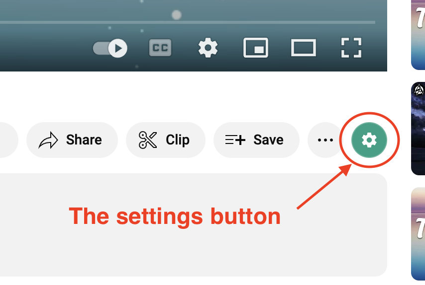

# Youtube Clean Mode Extension

## Introduction

In recent years, YouTube has become an increasingly popular platform for video sharing, with millions of users watching and uploading videos every day. However, sometimes the distractions on the site can be overwhelming, with video titles, control buttons, and suggested videos all vying for attention on the screen.

To address this issue, I've created this extension **Youtube Clean Mode** - a new extension for Youtube that allows users to customize their viewing experience by hiding certain elements of the page. Specifically, this extension offers the ability to hide the title of the current video, the controller, and suggested videos, as well as a theater mode that highlights the video frame by blurring the background. By giving users more control over their viewing experience, this extension could help make YouTube a more user-friendly platform for all types of viewers.

## Check accessibility

The Jungle Green settings button is now accessible from Youtube webpage.

If you see no settings button, please refresh the webpage in the browser or close your Youtube tab and re-open. If after refreshing, the settings button is still not shown you, keep contact with me. My email address **giang66.dev@gmail.com**

## Menu settings

When you click on the settings button, you can see the menu settings like this.

These settings allow you:

-   Hide title: allow you to hide the title of current video.
-   Hide header: allow you to hide the header title in full screen mode.
-   Hide controller: allow you to hide the video controller.
-   Hide progress: allow you to hide the progress bar in the controller.
-   Hide suggestions: allow you to hide the suggested video at the end of the video.
-   Theater mode: this setting will highlight the video frame by blurring the background. Notice: this option cannot accessible in full screen mode.
-   All: quick start to hide all settings above.

## I clicked the settings button but see no menu settings?

"I can see the settings button accessible. However, when I clicked on it, the menu not appeared."

If you have an issue like that, do not be confused. Close the current tab of Youtube, then open another tab.

If even after opened in the new tab, the menu settings still not working. Shutting down your browser and re-open it.

## Support me

If you find this extension is helpful, you can buy me a coffee as donating.

My MOMO account **0903049554 - PHAM TRUONG GIANG**

Thank you, hope you enjoy!
